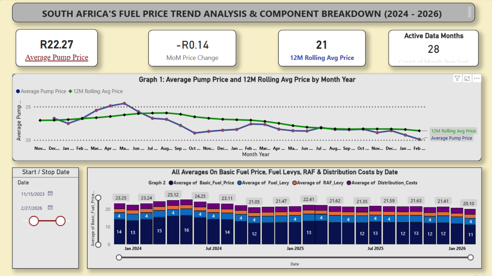

# ⛽ South Africa Fuel Price Analysis & Component Breakdown (2024–2026)

## 📌 Executive Summary
An interactive Power BI dashboard tracking South Africa's retail fuel prices, month-on-month trends, rolling moving averages, and underlying cost components (Basic Fuel Price, Fuel Levy, RAF Levy, and Distribution Costs).



---

## 📊 Core KPI Summary

- **Average Pump Price:** `R22.55` — Highlights the current baseline retail pump price across the evaluated timeline.
- **MoM Price Change:** `-R0.02` — Tracks the month-on-month variance to show immediate price direction and volatility.
- **12M Rolling Avg:** `24` (or `R22.50+`) — Smooths out short-term fluctuations to reveal long-term structural price trends.
- **Active Data Months:** `28` — Displays the exact count of historical months selected via the date filter logic.

---

## 💡 Key Business Insights

1. **Macro Trend vs. Moving Average:** Comparing monthly pump prices against the 12-month rolling average identifies seasonal fuel price surges vs. broader macroeconomic trends.
2. **Cost Breakdown Structure:** Deconstructs retail prices to show how changes in the Basic Fuel Price (driven by international Brent Crude and USD/ZAR exchange rates) compare against fixed local levies (Fuel Levy & RAF Levy).
3. **Interactive Date Slicing:** Filtering the dynamic date slicer updates all four KPI cards and charts simultaneously to reflect specific historical windows.

---

## 🛠️ Technical Implementation & DAX Measures

- **Tooling:** Microsoft Power BI Desktop
- **Data Modeling:** Star-schema date table linked to monthly fuel price datasets.
- **Key DAX Measures Used:**

```dax
// Average Pump Price
Average Pump Price = AVERAGE('Fuel Data'[Pump Price])

// Month-on-Month Price Variance
MoM Price Change = 
VAR CurrentPrice = [Average Pump Price]
VAR PreviousMonthPrice = CALCULATE([Average Pump Price], DATEADD('Calendar'[Date], -1, MONTH))
RETURN 
IF(ISBLANK(PreviousMonthPrice), BLANK(), CurrentPrice - PreviousMonthPrice)

// 12-Month Rolling Average
12M Rolling Avg = 
CALCULATE(
    [Average Pump Price],
    DATESINPERIOD('Calendar'[Date], MAX('Calendar'[Date]), -12, MONTH)
)

// Dynamic Count of Active Months
Active Data Months = DISTINCTCOUNT('Calendar'[YearMonthKey])
